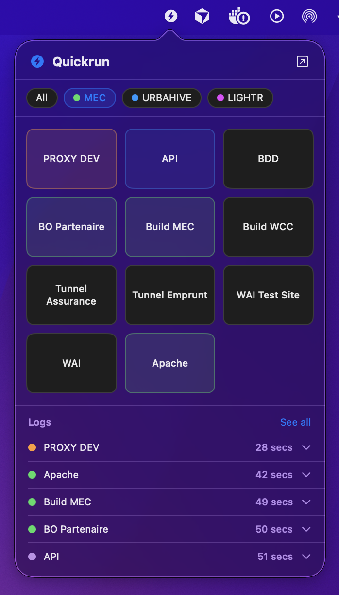
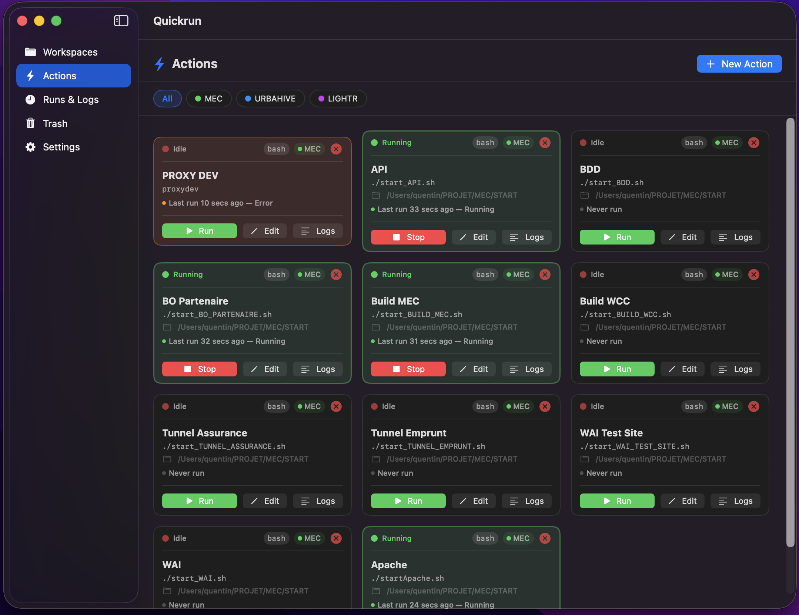

# Quickrun

A native macOS menu bar app to run and manage shell scripts in one click.


<p align="center">
  
  &nbsp;&nbsp;&nbsp;
  
</p>

## Features

- **Menu bar access** — click the icon to open a compact panel with all your actions
- **Action tiles** — run or stop any script in one click, with live status color feedback
- **Workspaces** — group actions by project and filter them instantly
- **Shell support** — bash or zsh, with optional profile loading (`~/.bash_profile`, `~/.bashrc`)
- **Advanced scripts** — multiline commands, custom working directory, environment variables, timeout
- **Run history & logs** — view output logs per run, with live scrolling
- **Trash** — deleted actions go to the trash and can be restored
- **Export / Import** — backup and restore your configuration as JSON
- **Launch at login** — optionally start Quickrun with macOS
- **Theme** — light, dark, or system

## Requirements

- macOS 13 Ventura or later
- Xcode 15+

## Getting started

```bash
git clone https://github.com/YOUR_USERNAME/quickrun.git
cd quickrun
open Quickrun.xcodeproj
```

Build and run with `⌘R`. The app is **not sandboxed** so it can execute arbitrary shell scripts with your user privileges.

## Configuration

Actions and workspaces are stored as JSON in:

```
~/Library/Application Support/Quickrun/actions.json
~/Library/Application Support/Quickrun/workspaces.json
~/Library/Application Support/Quickrun/trash.json
```

You can edit these files manually or use **Settings → Export / Import** to back up and restore your configuration.

## Project structure

```
Quickrun/
├── Models.swift          # Data models: Action, Workspace, Run, TrashedAction
├── ActionStore.swift     # Persistence for actions and trash
├── WorkspaceStore.swift  # Persistence for workspaces
├── RunStore.swift        # Process execution and run history
├── ProcessRunner.swift   # Shell process launcher
├── AppDelegate.swift     # NSStatusItem, NSPopover, store ownership
├── QuickrunApp.swift     # SwiftUI App entry point
├── MainWindowView.swift  # Root navigation (sidebar + tabs)
├── PanelView.swift       # Menu bar popover panel
├── ActionsView.swift     # Actions tab (tile grid)
├── WorkspacesView.swift  # Workspaces tab
├── TrashView.swift       # Trash tab
├── RunsView.swift        # Runs & Logs tab
├── LogsView.swift        # Log viewer
├── ActionFormView.swift  # Create / edit action sheet
├── SettingsView.swift    # Settings tab
└── AppSettings.swift     # Theme enum and settings keys
```

## Documentation

- [Functional documentation](docs/functional.md) — how to use the app (panel, actions, workspaces, logs, settings)
- [Technical documentation](docs/technical.md) — architecture, stores, process execution, UI patterns, pbxproj

## License

MIT — see [LICENSE](LICENSE).
